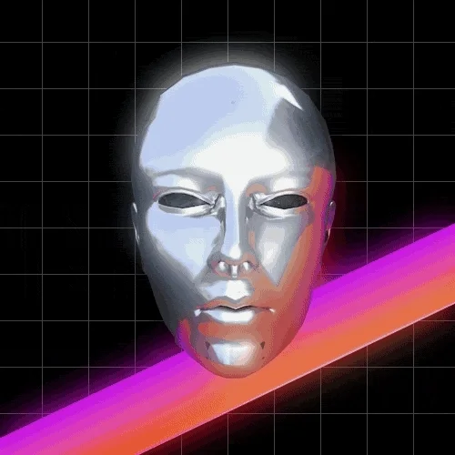

<!-- Greet Line Comes Here -->

<!-- Coloured Line -->
<h3 align="center">

</h3>

Welcome to Yung Havy! I'm passionate about developing innovative solutions and contributing to the open-source community. Here's a glimpse into my world:

## 🔧 Technologies & Tools

### My Development Stacks

### Design & Multimedia Tools

## 📊 GitHub Stats

#

## Github Graph
<!-- Coloured Line -->
<h3 align="center">

</h3>

<!-- GitHub Contribution Section Here -->

## 📈 GitHub Contribution Graph

<!-- Coloured Line -->
<h3 align="center">

</h3>

## 🏆 GitHub Trophies

## 💼 What I Do
- **Web Development:** Building responsive and user-friendly web applications using the latest technologies.
- **Data Cleaning and Visualization:** Organizing and visualizing data to extract meaningful insights.
- **UI/UX Design:** Creating intuitive and engaging user interfaces with tools like Figma and Adobe XD.
- **Photographer and Cinematographer:** Capturing stunning visuals and creating cinematic experiences.
- **Open Source Contributions:** Contributing to projects that align with my interests and skills.

## 🔗 Connect with Me

## 🌟 Highlighted Projects
- **[Project 1](https://github.com/yunghavy/Complex-css-Animations):** Here's an example of a sophisticated CSS animation that I created. This animation showcases advanced CSS techniques such as keyframes, transforms, and transitions to create smooth and visually appealing effects. Whether it's animating elements for a website or creating interactive UI components, I enjoy pushing the boundaries of what's possible with CSS.
- **[Project 2](https://github.com/yunghavy/NGO):** A website supporting an NGO focusing on women and children. This project aims to raise awareness and provide resources for empowering women and protecting children's rights.
- **[Project 3](https://github.com/yunghavy/mechauto):** A platform for mechanics and car enthusiasts to connect. This project provides tools and resources for fixing cars, sharing knowledge, and building a community around automotive repair.

---
